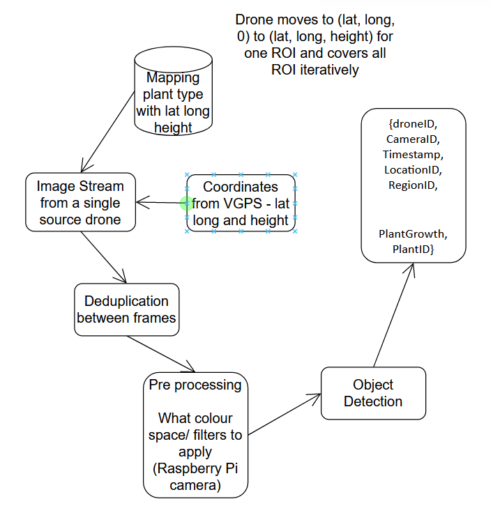

# ಭೂಮಿ / Bhoomi Vision Module

#### Vision Model for drone navigating a greenhouse

### Powered by
* [S Labs Solutions, India.](https://slabstech.com)

* NASA Space Apps [2022 Global Nominee](https://2022.spaceappschallenge.org/locations/magdeburg/teams)
* [Demo - https://mangala.earth](https://mangala.earth)

<!-- Embed Generator https://www.labnol.org/embed/google/drive/ 
Manifest - https://www.mozilla.org/en-US/about/manifesto/

Drive https://drive.google.com/drive/folders/18G5hCIlTgJR4C71wIoHms6DEFuJpF5Gk
>